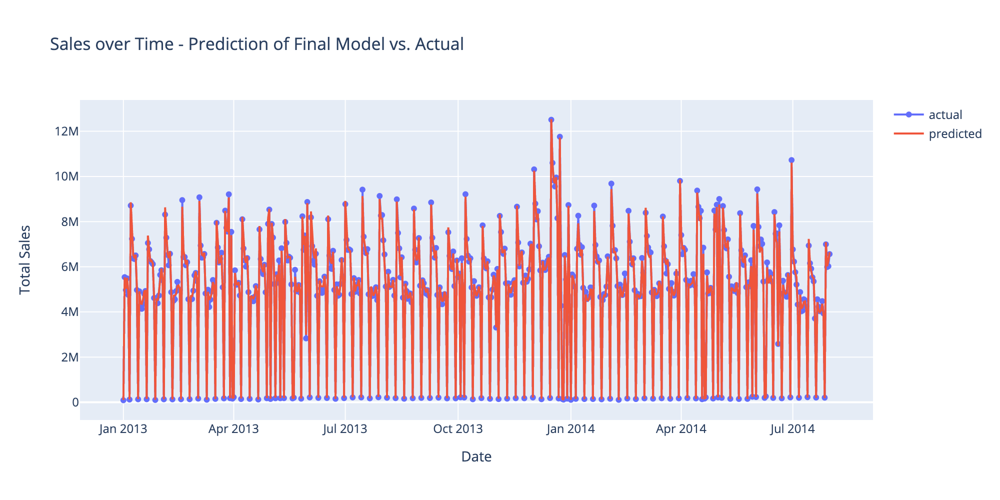

# Rossman Kaggle Mini-Competition

This mini competition is adapted from the Kaggle Rossman challenge.
The goal is to predict the sales number of Rossman stores over time.

The data given includes the daily sales number of Rossman stores
from January 2014 to July 2015.

In addition, information on the individual stores is provided,
such as the type of store, the assortment of items sold, etc.

### Team Members

- Maryam Faramarzi
- Naveen Korra
- Frank Schlosser

## Result

The best trained model was a LightGBM model.

It achieved an error of 16.174% on the test data
using the root mean square percentage error (RMSPE):


A more detailed explanation of the model is given in the notebook
[model_analysis](notebooks/model_explanation.ipynb)

Comparison of prediction vs. actual sales per day:



## Usage

### Setup

First, clone and repository and enter it

```bash
git clone git@github.com:franksh/dsr-rossman-comp.git
cd dsr-rossman-comp
```

Create a virtual environment using Python `3.8`, for example using `conda`.

```bash
conda create -n rossman-comp python=3.8
conda activate rossman-comp
```

Then install the required packages using

```bash
pip -r requirements.txt
```

### Testing a model

The pre-trained models are stored under `data/trained_models/`

To evaluate a model, run:

```bash
cd scripts
python score_on_holdout.py --holdout_path=path
```

The `holdout_path` should point to a file
containing holdout data in the correct format.

By default, the best trained model is used. You can
specify a different model using the parameter `pipeline`.

### Creating a Kaggle Submission

To create a model prediction and Kaggle submission file, run:

```bash
cd scripts
python create_submission.py --pipeline=pipeline_name
```

You can specify which pipeline to use for the submission.

If you pass `best` or no argument, the best current
model is used.

Different trained pipelines (including the model)
are stored under `/data/trained_pipelines/`.

## Additional Information

### Dataset

The dataset is made of two csvs:

```
#  store.csv
['Store', 'StoreType', 'Assortment', 'CompetitionDistance', 'CompetitionOpenSinceMonth', 'CompetitionOpenSinceYear', 'Promo2', 'Promo2SinceWeek', 'Promo2SinceYear', 'PromoInterval']

#  train.csv
['Date', 'Store', 'DayOfWeek', 'Sales', 'Customers', 'Open', 'Promo','StateHoliday', 'SchoolHoliday']
```

Description of included columns:

```
Id - an Id that represents a (Store, Date) duple within the test set

Store - a unique Id for each store

Sales - the turnover for any given day (this is what you are predicting)

Customers - the number of customers on a given day

Open - an indicator for whether the store was open: 0 = closed, 1 = open

StateHoliday - indicates a state holiday. Normally all stores, with few exceptions, are closed on state holidays. Note that all schools are closed on public holidays and weekends. a = public holiday, b = Easter holiday, c = Christmas, 0 = None

SchoolHoliday - indicates if the (Store, Date) was affected by the closure of public schools

StoreType - differentiates between 4 different store models: a, b, c, d

Assortment - describes an assortment level: a = basic, b = extra, c = extended

CompetitionDistance - distance in meters to the nearest competitor store

CompetitionOpenSince[Month/Year] - gives the approximate year and month of the time the nearest competitor was opened

Promo - indicates whether a store is running a promo on that day

Promo2 - Promo2 is a continuing and consecutive promotion for some stores: 0 = store is not participating, 1 = store is participating

Promo2Since[Year/Week] - describes the year and calendar week when the store started participating in Promo2
PromoInterval - describes the consecutive intervals Promo2 is started, naming the months the promotion is started anew. E.g. "Feb,May,Aug,Nov" means each round starts in February, May, August, November of any given year for that store
```

The holdout test period is from 2014-08-01 to 2015-07-31 - the holdout test dataset is the same format as `train.csv`, as is called `holdout.csv`.
